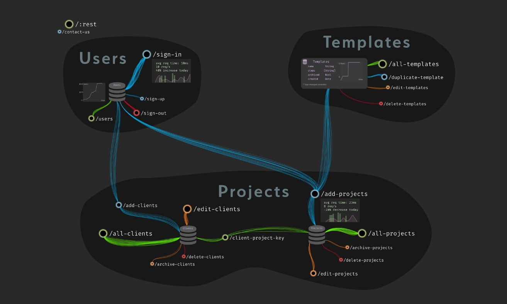

# Canvas / code organization

## Dark v1 problems

### Code layout

The layout of code in Dark v1 is ugly and unloved. It was a compromise to get it shipped, but not what's actually needed.

The vision for how we display code in the editor is called the "Architectural View". It's intended as a better way to view your components of your infrastructure than files and folders. Instead, you view your infrastructure according to its structure - that is, the same way you would see it if a senior engineer was drawing your infrastructure on the whiteboard.

An example:

This is a simple app that probably does something like project tracking, and it has 3 services: users, templates, and projects. Each of the HTTP routes is clustered around the database that they affect. Some of the DBs and routes have stats showing. The lines between the different routes represent traffic. 

### Problems

* dark code is currently in "boxes" that users drag around
  * some users drag them to high precision and it bothers them if they're not lined up. Of course, they grow when you add code!
* users can't see multiple functions at the same time
* we currently load the entire canvas at once, which can sometimes be too big
* no way to group things
* Users have many canvases. The intent was for users to have a single canvas with everything in it.
* Need a way to display modules that's separate from how we display "structural" components

## Solutions:

* implement the architectural view
* find a way to display modules of functions/types that's not the architectural view
* add grouping of canvas elements, reimplement multiple canvases as a single canvas with multiple groups.

